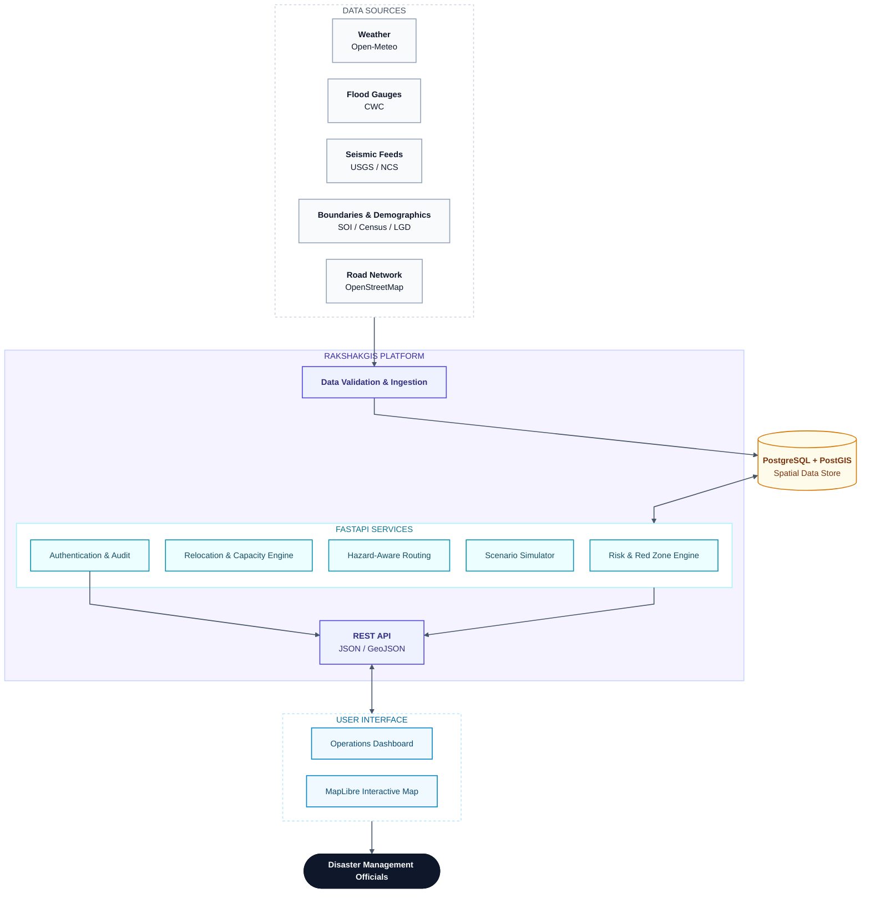
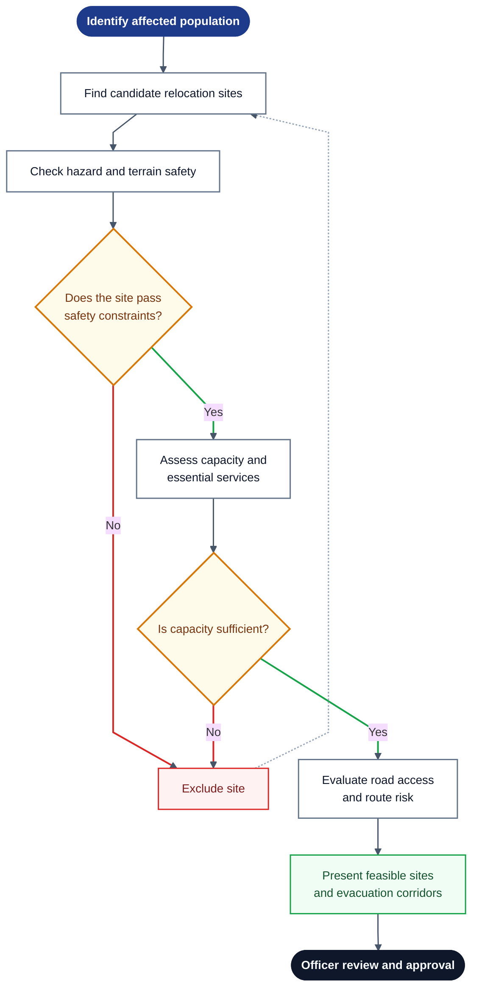

<div align="center">

# 🛡️ RakshakGIS

### Intelligent Identification of Hazard-Based Red Zones, Carrying Capacity Assessment, and Relocation Planning

<br/>


<br/>

[](http://65.2.84.177)
[](https://youtu.be/_ubteCFdp9c)

<br/>

*An explainable geospatial decision-support platform for assessing multi-hazard risk, identifying vulnerable settlements, evaluating relocation capacity, and planning safer evacuation routes.*

<br/>

[Overview](#-overview) · [Features](#-key-features) · [Architecture](#-system-architecture) · [Workflows](#-core-workflows) · [Methodology](#-risk-assessment-methodology) · [Roadmap](#-aiml-roadmap) · [Stack](#-technology-stack) · [Quick Start](#-quick-start) · [Data](#-data-sources--attribution) · [Status](#-project-status)

</div>

---

## 📖 Overview

Disaster response teams often work with fragmented hazard data, uncertain evacuation routes, and limited information about relocation-site capacity. RakshakGIS brings these workflows together in one platform, helping authorities assess settlement-level risk, visualize Red Zones, compare potential relocation sites, and review evacuation corridors.

> [!IMPORTANT]
> **Human oversight:** RakshakGIS provides analytical recommendations, not autonomous emergency dispatch. Authorized officials must review and approve Red Zone boundaries, relocation assignments, and evacuation routes.

---

## ✨ Key Features

| | Feature | Description |
|:-:|---|---|
| 🌪️ | **Multi-hazard risk assessment** | Explainable composite risk scoring across hazard severity, flood risk, rainfall, terrain, service access, and social vulnerability. |
| 🟥 | **Dynamic and permanent Red Zones** | Distinguishes persistent susceptibility from acute conditions and threshold breaches. |
| 🏘️ | **Village vulnerability profiles** | Uses demographic and socioeconomic indicators to understand population exposure. |
| 🏥 | **Relocation capacity assessment** | Evaluates site safety and the limiting capacity of essential services such as housing, water, sanitation, healthcare, and shelter. |
| 🧭 | **Risk-aware evacuation routing** | Uses Dijkstra's algorithm to find routes while accounting for hazard exposure and road restrictions. |
| 🧪 | **Scenario simulation** | Tests hypothetical changes—such as increased rainfall—without modifying baseline records. |
| 📋 | **Auditable decisions** | Includes role-based access, decision logs, and explicit handling of unavailable data. |

---

## 🏗️ System Architecture

The platform follows a clear flow: external datasets are validated and processed by backend services, persisted in a spatial database, and exposed through the API to the interactive map and dashboard.



---

## 🔄 Core Workflows

### 1️⃣ Risk Assessment & Red Zone Identification


### 2️⃣ Relocation & Evacuation Planning



<sub>**Legend:** 🟦 start · ⬜ process step · 🟨 decision · 🟥 exclusion / insufficient data · 🟩 outcome · ⬛ human review</sub>

---

## 📐 Risk Assessment Methodology

The current deterministic model uses the following weighted formulation:

$$
\text{Risk Score} = 0.30H + 0.20F + 0.15R + 0.15S + 0.10D + 0.10V
$$

| Factor | Weight | Share | Meaning |
|:-:|--:|:--|---|
| `H` | 30% | `██████` | Hazard severity |
| `F` | 20% | `████` | Flood risk |
| `R` | 15% | `███` | Rainfall |
| `S` | 15% | `███` | Slope and landslide susceptibility |
| `D` | 10% | `██` | Distance to essential services |
| `V` | 10% | `██` | Social vulnerability |

The factors are combined into a score from 0 to 100 and mapped to risk bands. If required inputs are missing, the system reports `INSUFFICIENT_DATA` rather than silently treating missing values as zero. Refer to the implementation for the exact normalization and band thresholds.

---

## 🤖 AI/ML Roadmap

A CNN-LSTM model is planned for a future research phase: CNN layers would extract spatial patterns, while LSTM layers would model temporal dependencies in rainfall and river-gauge data.

> [!NOTE]
> **The current live decision loop uses deterministic calculations; CNN-LSTM forecasting is not represented as a deployed feature.**

---

## 🧰 Technology Stack

| Layer | Technologies |
|---|---|
| 🖥️ **Frontend** | `Next.js 14` · `TypeScript` · `Tailwind CSS` · `MapLibre GL JS` · `Recharts` |
| ⚙️ **Backend** | `FastAPI` · `Python 3.11` · `Pydantic` · `SQLAlchemy` · `GeoAlchemy2` · `Shapely` · `PyProj` |
| 🗄️ **Database / GIS** | `PostgreSQL 16` · `PostGIS 3.4` |
| ☁️ **Infrastructure** | `Docker Compose` · `AWS EC2` · `Terraform` |
| 🧪 **Testing** | `Vitest` · `Pytest` |

---

## 🌐 Live Demo & Video

| | Resource | Link |
|:-:|---|---|
| 🚀 | **Deployed application** | [http://65.2.84.177](http://65.2.84.177) |
| 🎬 | **Project walkthrough** | [Watch on YouTube](https://youtu.be/_ubteCFdp9c) |

---

## ⚡ Quick Start

```bash
git clone https://github.com/OjaswiJoshi13/rakshakgis.git
cd rakshakgis
cp .env.example .env
docker compose up --build -d
```

Check service status and the backend health endpoint:

```bash
docker compose ps
curl http://localhost:8000/health
```

| Service | URL |
|---|---|
| 🖥️ Frontend | `http://localhost:3000` |
| 📚 API documentation | `http://localhost:8000/docs` |

For full data ingestion and end-to-end validation, see `docs/DEPLOYMENT.md`.

---

## 🗂️ Data Sources & Attribution

| Source | Data | License / Note |
|---|---|---|
| **Census of India (2011) and LGD** | Demographics and administrative data | Government Open Data License – India (GODL-India) |
| **Survey of India** | Administrative boundaries | Refer to the applicable Government of India terms |
| **National Centre for Seismology (NCS)** | Seismic catalogs | — |
| **Open-Meteo** | Meteorological data | CC BY 4.0; it is an open provider, not IMD |
| **Central Water Commission (CWC)** | River-gauge information and danger levels | — |
| **USGS Earthquakes** | Seismic event feeds | Public domain |
| **OpenStreetMap** | Road-network data | ODbL 1.0; attribution is required |

---

## 🚦 Project Status

The repository's `PROJECT_STATE.md` is the source of truth for milestone status.

| Status | Milestones |
|:-:|---|
| ✅ **Completed** | Core risk, Red Zone, relocation, routing, dashboard, integration, and cloud-deployment milestones |
| 🗓️ **Planned** | CNN-LSTM forecasting and multi-state expansion |
| ⏸️ **Deferred** | Copernicus DEM raster downloads |

> [!WARNING]
> Elevation data must be treated as unavailable where it has not been ingested.

---

## 👥 Team & License

<div align="center">

**EndgameX** · SIH 2026 · `SIH26191` · Team ID `148879`

</div>

The software is proprietary to Team EndgameX pending formal license assignment. External datasets remain subject to their respective licenses.
