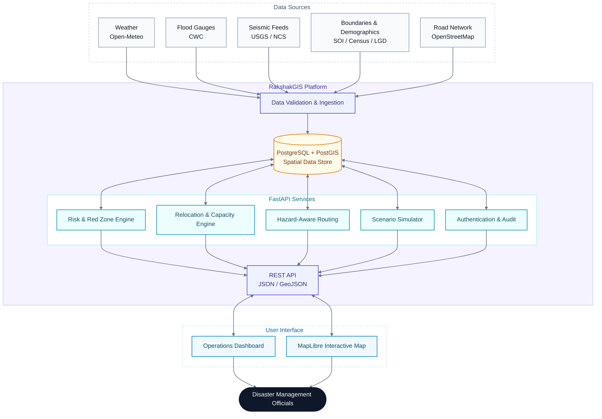
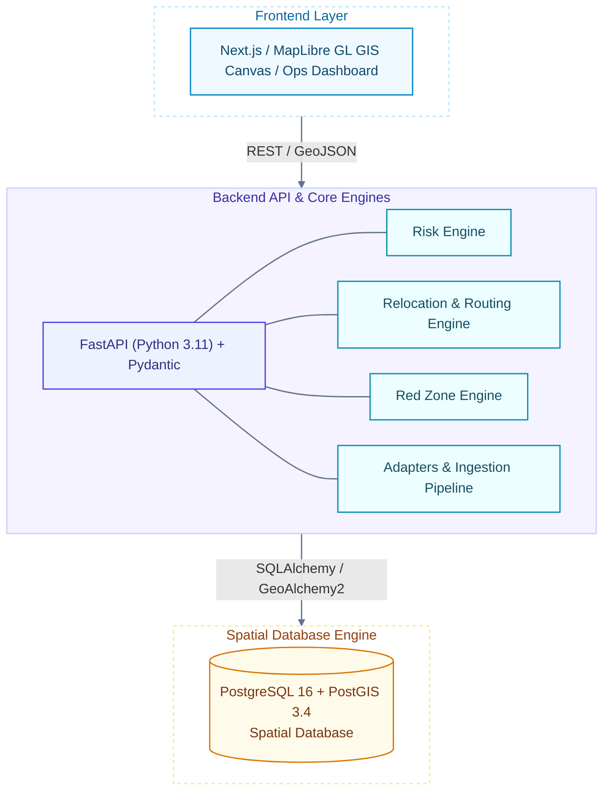
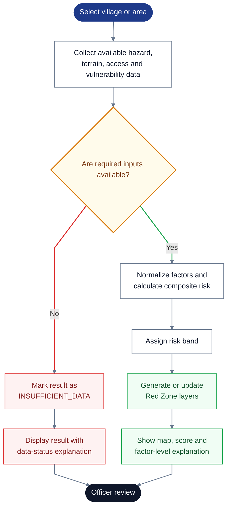
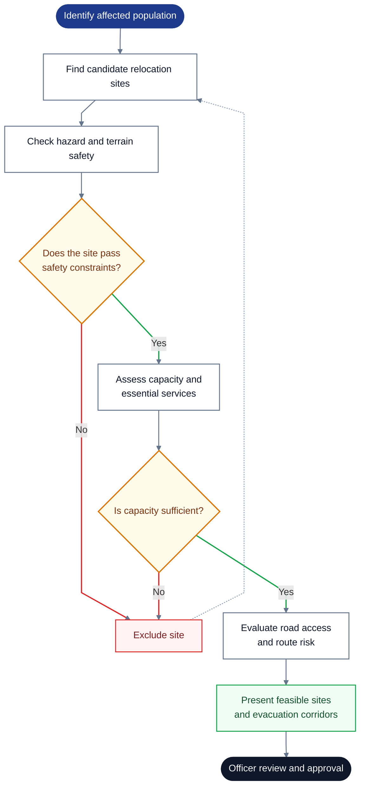

<div align="center">

# 🛡️ RakshakGIS

### Intelligent Identification of Hazard-Based Red Zones, Carrying Capacity Assessment, and Relocation Planning

<br/>


<br/>

[](http://65.2.84.177)
[](https://youtu.be/_ubteCFdp9c)

<br/>

*An explainable geospatial decision-support platform for assessing multi-hazard risk, identifying vulnerable settlements, evaluating relocation capacity, and planning safer evacuation routes.*

<br/>

[Overview](#-overview) · [Features](#-key-features) · [Architecture](#-system-architecture) · [Workflows](#-core-workflows) · [Methodology](#-risk-assessment-methodology) · [Roadmap](#-aiml-roadmap) · [Stack](#-technology-stack)

[Requirements](#-system-requirements) · [Quickstart](#-quickstart--local-setup) · [Commands](#-development-commands) · [Structure](#-repository-structure) · [Data](#-data-architecture--bootstrap-workflow) · [Collaboration](#-team-collaboration-workflow) · [Status](#-project-status)

</div>

---

## 📖 Overview

Disaster response teams often work with fragmented hazard data, uncertain evacuation routes, and limited information about relocation-site capacity. RakshakGIS brings these workflows together in one platform, helping authorities assess settlement-level risk, visualize Red Zones, compare potential relocation sites, and review evacuation corridors.

**RakshakGIS** is designed to provide actionable intelligence for disaster management authorities and district administration officers. It combines geospatial data analysis, deterministic multi-hazard risk modeling, vulnerability indices, and constrained relocation site suitability to support critical decision-making before, during, and after disasters.

> [!IMPORTANT]
> **Human oversight:** RakshakGIS provides analytical recommendations, not autonomous emergency dispatch. Authorized officials must review and approve Red Zone boundaries, relocation assignments, and evacuation routes.

---

## ✨ Key Features

| | Feature | Description |
|:-:|---|---|
| 🌪️ | **Multi-hazard risk assessment** | Explainable composite risk scoring across hazard severity, flood risk, rainfall, terrain, service access, and social vulnerability. |
| 🟥 | **Dynamic and permanent Red Zones** | Distinguishes persistent susceptibility from acute conditions and threshold breaches. |
| 🏘️ | **Village vulnerability profiles** | Uses demographic and socioeconomic indicators to understand population exposure. |
| 🏥 | **Relocation capacity assessment** | Evaluates site safety and the limiting capacity of essential services such as housing, water, sanitation, healthcare, and shelter. |
| 🧭 | **Risk-aware evacuation routing** | Uses Dijkstra's algorithm to find routes while accounting for hazard exposure and road restrictions. |
| 🧪 | **Scenario simulation** | Tests hypothetical changes—such as increased rainfall—without modifying baseline records. |
| 📋 | **Auditable decisions** | Includes role-based access, decision logs, and explicit handling of unavailable data. |

---

## 🏗️ System Architecture

The platform follows a clear flow: external datasets are validated and processed by backend services, persisted in a spatial database, and exposed through the API to the interactive map and dashboard.



### Layered View

The system is structured across four primary layers:



---

## 🔄 Core Workflows

### 1️⃣ Risk Assessment & Red Zone Identification



### 2️⃣ Relocation & Evacuation Planning



<sub>**Legend:** 🟦 start · ⬜ process step · 🟨 decision · 🟥 exclusion / insufficient data · 🟩 outcome · ⬛ human review</sub>

---

## 📐 Risk Assessment Methodology

The current deterministic model uses the following weighted formulation:

$$
\text{Risk Score} = 0.30H + 0.20F + 0.15R + 0.15S + 0.10D + 0.10V
$$

| Factor | Weight | Share | Meaning |
|:-:|--:|:--|---|
| `H` | 30% | `██████` | Hazard severity |
| `F` | 20% | `████` | Flood risk |
| `R` | 15% | `███` | Rainfall |
| `S` | 15% | `███` | Slope and landslide susceptibility |
| `D` | 10% | `██` | Distance to essential services |
| `V` | 10% | `██` | Social vulnerability |

The factors are combined into a score from 0 to 100 and mapped to risk bands. If required inputs are missing, the system reports `INSUFFICIENT_DATA` rather than silently treating missing values as zero. Refer to the implementation for the exact normalization and band thresholds.

---

## 🤖 AI/ML Roadmap

A CNN-LSTM model is planned for a future research phase: CNN layers would extract spatial patterns, while LSTM layers would model temporal dependencies in rainfall and river-gauge data.

> [!NOTE]
> **The current live decision loop uses deterministic calculations; CNN-LSTM forecasting is not represented as a deployed feature.**

---

## 🧰 Technology Stack

| Layer | Technologies |
|---|---|
| 🖥️ **Frontend** | `Next.js 14` · `TypeScript` · `Tailwind CSS` · `MapLibre GL JS` · `Recharts` |
| ⚙️ **Backend** | `FastAPI` · `Python 3.11` · `Pydantic` · `SQLAlchemy` · `GeoAlchemy2` · `Shapely` · `PyProj` |
| 🗄️ **Database / GIS** | `PostgreSQL 16` · `PostGIS 3.4` |
| ☁️ **Infrastructure** | `Docker Compose` · `AWS EC2` · `Terraform` |
| 🧪 **Testing** | `Vitest` · `Pytest` |

---

## 🌐 Live Demo & Video

| | Resource | Link |
|:-:|---|---|
| 🚀 | **Deployed application** | [http://65.2.84.177](http://65.2.84.177) |
| 🎬 | **Project walkthrough** | [Watch on YouTube](https://youtu.be/_ubteCFdp9c) |

---

## 🧱 System Requirements

To run and develop RakshakGIS locally, the following tools are required:

| Tool | Recommended Version | Purpose |
|---|---|---|
| **Git** | 2.40+ | Version control & synchronization |
| **Docker Desktop / Engine** | 24.0+ (Docker 29+) | Containerized services |
| **Docker Compose** | v2.20+ (Compose v5+) | Multi-container orchestration |
| **Python** *(optional for host dev)* | 3.11.x | Local virtual environment & script execution |
| **Node.js & npm** *(for frontend)* | Node v20+ / v22+, npm 10+ | Frontend development (when implemented) |

---

## ⚡ Quickstart & Local Setup

### 1. Clone the Repository

```bash
git clone https://github.com/OjaswiJoshi13/rakshakgis.git
cd rakshakgis
```

### 2. Configure Environment Variables

Copy the example configuration to `.env`:

**Linux / macOS / Git Bash:**

```bash
cp .env.example .env
```

**Windows (PowerShell):**

```powershell
Copy-Item .env.example .env
```

> [!CAUTION]
> **Security Reminder:** Never commit `.env` or any real API keys, passwords, or credentials into version control. `.env` is ignored by `.gitignore`.

### 3. Build and Start Services via Docker Compose

```bash
docker compose up --build -d
```

Check the status of running services:

```bash
docker compose ps
```

View real-time service logs:

```bash
docker compose logs -f
```

Check the backend health endpoint:

```bash
curl http://localhost:8000/health
```

| Service | URL |
|---|---|
| 🖥️ Frontend | `http://localhost:3000` |
| 📚 API documentation | `http://localhost:8000/docs` |

For full data ingestion and end-to-end validation, see `docs/DEPLOYMENT.md`.

---

## 🛠️ Development Commands

| Action | Command |
|---|---|
| **Validate Compose Config** | `docker compose config` |
| **Build Images** | `docker compose build` |
| **Start Services (Detached)** | `docker compose up -d` |
| **Start with Rebuild** | `docker compose up --build -d` |
| **Stop Services** | `docker compose down` |
| **Stop and Remove Volumes** | `docker compose down -v` *(Caution: resets database)* |
| **View Service Status** | `docker compose ps` |
| **View Logs (All Services)** | `docker compose logs -f` |
| **View Database Logs** | `docker compose logs -f db` |
| **View Backend Logs** | `docker compose logs -f backend` |

---

## 📁 Repository Structure

```text
rakshakgis/
├── .env.example          # Template for local environment variables
├── .gitignore            # Git exclusion rules for secrets, caches, and builds
├── docker-compose.yml    # Docker Compose definition (PostGIS db + backend)
├── PROJECT_STATE.md      # Authoritative project progress and chunk registry
├── README.md             # Project documentation and developer setup guide
├── requirements.txt      # Python dependencies with geospatial pins
├── backend/              # FastAPI application core
│   ├── Dockerfile        # Python 3.11 container definition with GDAL/GEOS/PROJ
│   ├── app/              # Application source code
│   │   ├── adapters/     # External data providers (IMD, telemetry, GeoServer)
│   │   ├── api/          # FastAPI routers and route handlers
│   │   ├── core/         # Settings, database session, security
│   │   ├── models/       # SQLAlchemy / GeoAlchemy2 spatial models
│   │   ├── schemas/      # Pydantic data validation schemas
│   │   └── services/     # Computational engines (Risk, Red Zone, Relocation)
│   └── tests/            # Automated test suite (pytest)
├── frontend/             # Next.js / React user interface (to be scaffolded in M5-01)
├── data/                 # Regional profiles, synthetic demo data, schemas
├── docs/                 # Architecture specifications and technical documentation
└── scripts/              # Utility scripts for data generation and database setup
```

---

## 🗃️ Data Architecture & Bootstrap Workflow

RakshakGIS operates under four strictly isolated data modes configured via `DATA_MODE` in `.env`:

| Mode | Use Case | Behavior |
|---|---|---|
| **`demo`** | SIH Presentation & Offline Development | Uses pre-packaged deterministic datasets (`app/data/synthetic/`). Zero external network dependencies. |
| **`full_data`** | Authoritative Planning & Analysis | Powered by PostgreSQL/PostGIS database populated from Census 2011, LGD administrative hierarchy, Survey of India village boundaries, and NCS seismology catalogs. **Missing data is explicit (`DATA_UNAVAILABLE`)**; calculations never assume missing values are zero or synthetic. |
| **`live`** | Operational Multi-Hazard Monitoring | Connects to real-time external providers:<br/>• **Open-Meteo**: Live precipitation and rainfall forecasts (CC-BY 4.0; *not labelled as IMD*).<br/>• **Central Water Commission (CWC) Flood AFF**: Live river gauge levels, danger thresholds, and flood forecasts.<br/>• **USGS Real-time Earthquakes**: Live seismic hazard observations for India bounding box. |
| **`simulation`** | Dynamic What-If Analysis | Modifies hazard/rainfall/road blockage parameters and reruns the real backend computational risk, Red Zone, priority, and matching engines deterministically. |

### Teammate Data Bootstrap (Reproducible Setup)

To bootstrap the local data environment on a fresh clone without manual hunting:

```bash
# 1. Start backing PostgreSQL / PostGIS container
docker compose up -d db

# 2. Run data directory bootstrap & register manifests
python scripts/setup_data.py

# 3. Verify local dataset checksums against verified SHA-256 manifest
python scripts/verify_data.py --quick

# 4. Ingest authoritative data (Census 2011, LGD, Survey of India, NCS) into PostGIS
python scripts/ingest_all.py

# 5. Run full 22-step Golden SIH demo flow verification
python scripts/validate_golden_sih_flow.py
```

---

## 🗂️ Data Sources & Attribution

| Source | Data | License / Attribution |
|---|---|---|
| **Census of India (2011) and LGD** | Census data and administrative hierarchy | Government Open Data License – India (GODL-India) |
| **Survey of India** | Administrative boundaries | Department of Science & Technology, Government of India; refer to the applicable Government of India terms |
| **National Centre for Seismology (NCS)** | Seismic catalogs | Ministry of Earth Sciences, Government of India |
| **Open-Meteo** | Meteorological data | CC BY 4.0; it is an open provider, not IMD |
| **Central Water Commission (CWC)** | River-gauge information and danger levels | — |
| **USGS Earthquakes** | Seismic event feeds | Public domain |
| **OpenStreetMap** | Road-network data | © OpenStreetMap contributors, licensed under the Open Database License (ODbL) 1.0; attribution is required |
| **Copernicus DEM (GLO-30)** | Elevation | Manifests tracked; DEM rasters deferred due to automated 403. Physical slope/elevation explicitly reported as unavailable in `full_data` mode. |
| **Bhuvan / GSI Landslide** | Landslide information | Official portal UI only; machine-readable endpoints not fabricated. |

---

## 🤝 Team Collaboration Workflow

All team members follow strict Git synchronization practices to prevent merge conflicts:

### 1. Synchronize Before Starting Work

```bash
git status
git fetch origin
git pull --rebase origin main
```

### 2. Implementation Rules

- Verify dependencies in [PROJECT_STATE.md](PROJECT_STATE.md) before starting any chunk.
- Stage only modified files explicitly (`git add <file>`), never `git add .`.
- **Never force-push (`git push --force`) to `main`.**
- If an ambiguous semantic merge conflict occurs during rebase, stop and report immediately.

---

## 🚦 Project Status

The repository's `PROJECT_STATE.md` is the source of truth for milestone status.

**Status:** Full Platform Implementation & Authoritative Data Pipeline Complete

> [!NOTE]
> **System Readiness Status:** The complete end-to-end platform is implemented, integrated, and validated across all tiers: PostgreSQL 16 + PostGIS 3.4 spatial database, FastAPI computational engines, live telemetry provider adapters, interactive MapLibre GIS canvas, and Next.js operations dashboard.

| Status | Milestones |
|:-:|---|
| ✅ **Completed** | Core risk, Red Zone, relocation, routing, dashboard, integration, and cloud-deployment milestones |
| 🗓️ **Planned** | CNN-LSTM forecasting and multi-state expansion |
| ⏸️ **Deferred** | Copernicus DEM raster downloads |

**Milestones completed:**

| Milestone | Scope |
|---|---|
| **M1 – M6** | Core Foundation, Risk, Vulnerability, Relocation, Routing, GIS Canvas, Operational Workflows |
| **INT-01, INT-02, INT-03** | Integration, SIH Flow Validation, Automated Quality Gates |
| **DATA-01** | Real-World Dataset Inventory & Manifest Distribution |
| **DATA-02** | Database Ingestion, Authoritative Adapters & Backend REST Endpoints |
| **INT-04** | End-to-End Real Data Integration, GIS Search, Governance Persistence & Pipeline Hardening |

For granular task statuses and formal audit records, refer to [PROJECT_STATE.md](PROJECT_STATE.md).

> [!WARNING]
> Elevation data must be treated as unavailable where it has not been ingested.

---

## 👥 Team & License

<div align="center">

**EndgameX** · SIH 2026 · `SIH26191` · Team ID `148879`

</div>

The software is proprietary to Team EndgameX pending formal license assignment. External datasets remain subject to their respective licenses.
